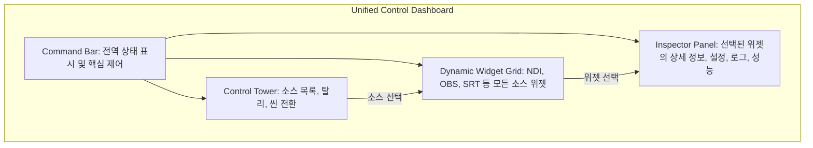

# 새로운 GUI 구조 설계 제안서 (New GUI Architecture Design Proposal)

## 1. 개요 및 비전

본 문서는 기존 `PD 통합 소프트웨어`의 GUI를 혁신하기 위한 새로운 설계안을 제안합니다. 4개의 핵심 기술 문서(`ADVANCED_IMPROVEMENT_PLAN`, `IMMEDIATE_IMPROVEMENTS`, `PD_SOFTWARE_GUI_DESIGN`, `TECHNICAL_SPECIFICATIONS`)를 종합적으로 분석한 결과, 현재 GUI는 기능적으로는 안정적이나 확장성, 직관성, 정보 밀도 측면에서 개선의 여지가 큰 것으로 파악되었습니다.

새로운 GUI의 비전은 **"Unified Control Dashboard"**입니다. 이는 단순한 모니터링 도구를 넘어, 방송 제작의 모든 요소를 하나의 화면에서 유기적으로 제어하고 파악할 수 있는 통합 제어 표면을 제공하는 것을 목표로 합니다.

## 2. 핵심 설계 철학

기존의 "상황 인식 우선(Situational Awareness First)" 원칙을 계승하고 다음 세 가지 원칙을 추가하여 설계 철학을 확장합니다.

*   **모듈성 (Modularity)**: 모든 기능은 독립적인 위젯으로 존재하며, 사용자가 필요에 따라 조합하고 배치할 수 있습니다. 이는 플러그인 시스템과 연계하여 무한한 확장성을 제공합니다.
*   **맥락성 (Context-Awareness)**: 사용자의 현재 작업(예: NDI 소스 선택, 설정 변경)에 따라 가장 필요한 정보와 컨트롤이 자동으로 표시됩니다.
*   **직관성 (Intuitiveness)**: 물리적인 방송 장비(프로덕션 스위처, 오디오 믹서 등)의 조작 경험을 디지털 환경에 자연스럽게 이식하여 학습 곡선을 최소화합니다.

## 3. 새로운 GUI 아키텍처

기존의 고정적인 패널 구조를 탈피하여, 사용자가 자유롭게 구성할 수 있는 동적인 대시보드 구조를 제안합니다.



*   **Command Bar (상단)**: 전체 시스템의 연결 상태(vMix, OBS, WebSocket), 마스터 녹화/스트리밍 버튼, 현재 시간, 전역 설정 접근 등 핵심 정보를 항상 표시합니다.
*   **Dynamic Widget Grid (중앙)**: NDI, OBS Scene, SRT Stream 등 모든 소스를 '위젯' 형태로 표시합니다. 사용자는 드래그앤드롭으로 위젯의 크기와 위치를 자유롭게 변경하고, 그룹화할 수 있습니다.
*   **Control Tower (좌측)**: 전체 소스 목록, 탈리 상태 리스트, OBS 씬 목록 등 빠른 전환과 선택을 위한 패널입니다. 여기서 항목을 클릭하면 중앙 그리드의 해당 위젯이 활성화됩니다.
*   **Inspector Panel (우측)**: 중앙 그리드나 컨트롤 타워에서 선택된 항목의 '모든 것'을 보여주는 맥락적 패널입니다. 로그, 상세 설정, 성능 그래프, 오디오 미터 등이 여기에 표시됩니다.

## 4. 와이어프레임 및 컴포넌트 아이디어

### 4.1. 소스 위젯 (Source Widget)

중앙 그리드를 구성하는 기본 단위입니다.

```
┌───────────────────────────┐
│ CAM-01 (NDI)   [⚙️] [↗️]    │  <-- 소스 이름, 설정, 전체화면 버튼
├───────────────────────────┤
│ ┌───────────────────────┐ │
│ │      [프리뷰 영상]      │ │  <-- 실시간 비디오 프리뷰
│ │                       │ │
│ └───────────────────────┘ │
├─────┬───────────────────┤
│ ●PGM │ ▂▃▅▇▆▅▃▂ (Audio)  │  <-- 탈리 상태 및 오디오 미터
└─────┴───────────────────┘
```
*   **상태 표시**: 테두리 색상(PGM:빨강, PVW:초록)과 좌측 하단 텍스트로 탈리 상태를 명확히 표시합니다.
*   **인터랙션**: 더블클릭 시 전체화면, 드래그로 위치 변경, 모서리를 드래그하여 크기 조절이 가능합니다.

### 4.2. 인스펙터 패널 (Inspector Panel)

소스 위젯 선택 시 해당 패널 내용이 동적으로 변경됩니다.

```
┌──────────────────────────┐
│ ▼ Inspector: CAM-01      │
├──────────────────────────┤
│ [설정] [성능] [로그] [메타] │  <-- 탭으로 정보 분류
├──────────────────────────┤
│ 📈 CPU: 5%  MEM: 128MB   │
│ 📉 프레임레이트: 59.94fps  │
│ 📊 비트레이트: 110Mbps     │
│ ─────── 오디오 설정 ─────── │
│ [ ] Mute   [ Solo ]        │
│ ─────── 녹화 설정 ─────── │
│ [ ● 녹화 시작 ]            │
└──────────────────────────┘
```
*   **성능 모니터링**: `IMMEDIATE_IMPROVEMENTS`에서 제안된 실시간 성능 모니터링 그래프가 여기에 통합됩니다.
*   **즉각적 제어**: 소스별 개별 녹화, 오디오 제어 등 상세 기능을 제공합니다.

## 5. 사용자 흐름 (User Flow)

### 시나리오 1: 방송 시작 및 소스 전환
1.  **Command Bar**에서 vMix, OBS, 서버 연결 상태가 모두 녹색인지 확인합니다.
2.  **Command Bar**의 마스터 '방송 시작' 버튼을 클릭합니다.
3.  **Control Tower**에서 'CAM-02'를 클릭하여 프리뷰(PVW)로 올립니다.
4.  중앙 그리드의 'CAM-02' 위젯 테두리가 녹색으로 바뀝니다.
5.  `Space` 키 또는 전환 버튼을 눌러 'CAM-02'를 프로그램(PGM)으로 보냅니다.
6.  'CAM-01' 위젯 테두리는 회색으로, 'CAM-02' 위젯 테두리는 빨간색으로 변경됩니다.

## 6. 구현 계획

### Phase 1: 기반 구축 (Foundation)
*   PyQt6를 사용하여 새로운 4단(Command Bar, Grid, Tower, Inspector) 레이아웃 구조를 구현합니다.
*   기본 NDI 소스 위젯을 개발하고 동적 그리드에 표시합니다.
*   기존 탈리 로직을 연동하여 위젯 테두리 색상으로 상태를 표시합니다.

### Phase 2: 핵심 기능 통합 (Core Feature Integration)
*   `IMMEDIATE_IMPROVEMENTS`의 기능들을 통합합니다.
    *   **Inspector Panel**에 성능 모니터링 위젯을 추가합니다.
    *   **Command Bar**에 다크/라이트 모드 토글 버튼을 추가합니다.
    *   설정 내보내기/가져오기 기능을 전역 설정 창에 구현합니다.
*   OBS 연동을 추가하고, OBS 씬을 위한 새로운 위젯 타입을 개발합니다.

### Phase 3: 확장성 및 고급 기능 (Scalability & Advanced Features)
*   `ADVANCED_IMPROVEMENT_PLAN`의 아이디어를 구현합니다.
    *   플러그인 시스템을 도입하여 사용자가 직접 새로운 위젯 타입을 추가할 수 있도록 합니다.
    *   Stream Deck 연동을 위한 API를 노출하고, 관련 설정을 Inspector Panel에 추가합니다.
    *   레이아웃 프리셋 저장/로드 기능을 구현합니다.